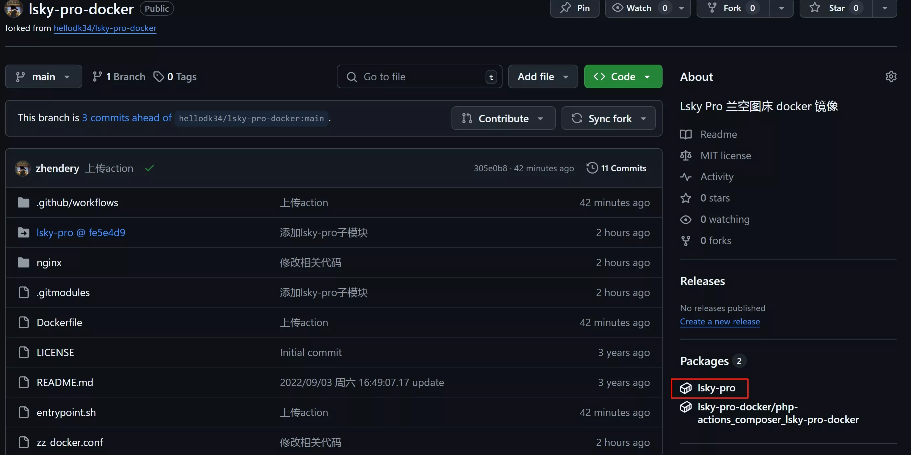
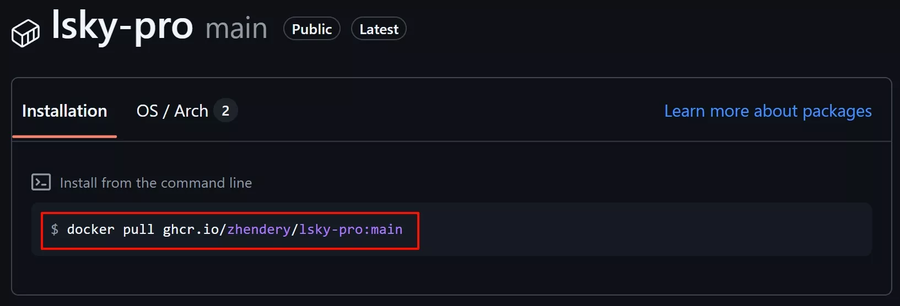
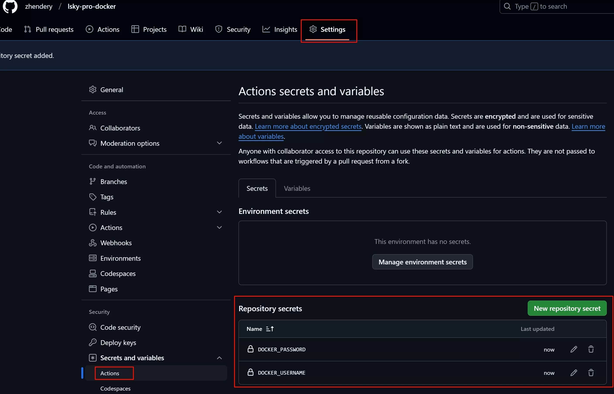

# lsky-pro-docker
[Lsky Pro兰空图床](https://github.com/lsky-org/lsky-pro)的docker镜像，Fork自[lsky-pro-docker](https://github.com/hellodk34/lsky-pro-docker)，添加了自动编译action，把基于apache改为基于alpine+nginx的镜像，镜像大小从838.1MB缩减到207.7MB，启动运行速度也会更快，适合个人和小型团队（家庭）使用。

## 如何使用

### 直接使用我编译好的镜像
```shell
mkdir -p /mnt/docker/lsky-pro # 路径按自己需求修改

docker run -d --name lsky-pro \ # 容器名按自己需求修改
  --restart=always -e TZ=Asia/Shanghai \ # 时区按自己需求修改
  -p 33333:80 \ # 端口按自己需求修改
  -v /mnt/docker/lsky-pro:/var/www/html \ # 挂载路径按自己需求修改
  zhendery/lsky-pro:official # 官方镜像，使用我的镜像替换为latest即可
```
lsky-pro的使用方法请自行参考[官方文档](https://docs.lsky.pro/guide/getting-started)，如果要使用我的镜像，请替换`zhendery/lsky-pro:official`为`zhendery/lsky-pro:latest`，或请查看我具体tag的发版说明然后替换为对应tag，我的镜像会添加一些我自己需要的功能，偏向通用的功能我自己长期使用测试下来没问题的话也有可能会申请合入官方。

### 自己编译镜像

1. 把项目fork到自己的仓库（根据需求选择我的或official的分支）；
2. **开启项目的Actions**，根据自己需求对代码进行修改，commit并push后action会自动开启编译和推送到github registry；
3. 等待action完成，在项目的packages页面可以看到编译好的镜像；

4. `docker pull ghcr.io/你的用户名(小写)/lsky-pro:main`拉取镜像，或直接`docker run`运行；

5. 测试自己修改的功能是否实装成功。

### 推送到docker hub
如果需要推送到dockerhub，需要在项目settings->secrets，添加：
   - `DOCKER_USERNAME`：你的dockerhub用户名
   - `DOCKER_PASSWORD`：你的dockerhub密码
   


然后发布tag，名称按自己需求修改（如v0.1.1或feature-xxx），会自动编译并推送到dockerhub（tag及latest）。

## 贡献
本人对docker、github actions等技术纯小白，对php更是一窍不通。单纯是因为lsky-pro好用但部分功能满足不了我，然后找到的dockerfile基于apache编译出来镜像太大了，个人用不着apache，所以才浅浅自学了一下就来班门弄斧。如果有问题或建议，欢迎提交issue或PR（我能力有限不一定能修复，也欢迎网友指正），同时也欢迎Star！

请提PR时遵循以下commit message规范（可以参考我近期的提交记录，请忽略我自己早期不规范的提交🥺）：
```
feat: 增加xxx功能
fix: 修复xxx问题 或 bugfix：xxx问题
doc: xxx文档更新
```


## 鸣谢

感谢[lsky-pro](https://github.com/lsky-org/lsky-pro)。
感谢[lsky-pro-docker](https://github.com/hellodk34/lsky-pro-docker)，本项目基于其修改而来。
