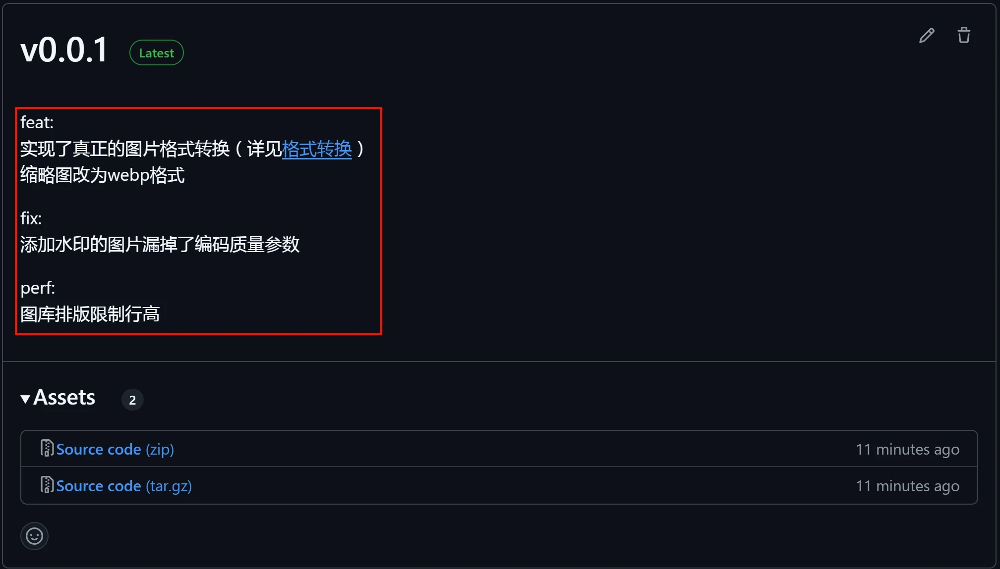

# lsky-pro-docker
[Lsky Pro兰空图床](https://github.com/lsky-org/lsky-pro)的docker镜像，Fork自[lsky-pro-docker](https://github.com/hellodk34/lsky-pro-docker)，添加了自动编译action，把基于apache改为基于alpine+nginx的镜像，镜像大小从838.1MB缩减到210.6MB，理论上启动和运行速度也会更快，适合个人和小团队（家庭）使用。

【注】非特殊情况后续文档不会在分支上更新，请以main的文档为准。

## 如何使用

### 直接使用我编译好的镜像
```shell
mkdir -p /mnt/docker/lsky-pro # 路径按自己需求修改

docker run -d --name lsky-pro \ # 容器名按自己需求修改
  --restart=always -e TZ=Asia/Shanghai \ # 时区按自己需求修改
  -p 33333:80 \ # 端口按自己需求修改
  -v /mnt/docker/lsky-pro:/var/www/html \ # 挂载路径按自己需求修改
  zhendery/lsky-pro:official # 官方镜像，使用我的镜像替换为latest即可
```
lsky-pro的使用方法请自行参考[官方文档](https://docs.lsky.pro/guide/getting-started)，如果要使用[我的镜像](https://github.com/zhendery/lsky-pro)，请替换`zhendery/lsky-pro:official`为`zhendery/lsky-pro:latest`，或请查看我具体的[发版说明](https://github.com/zhendery/lsky-pro-docker/releases)（如下图展示了v0.0.1的说明）然后替换为对应tag，我的镜像会添加一些我自己需要的功能，偏向通用的功能我自己长期使用测试下来没问题的话也有可能会申请合入官方。



official镜像只打开了mysql、sqlite、odbc扩展，默认关闭了pdo_pgsql，因为pgsql扩展严重影响编译时长和镜像大小。而latest镜像只打开了mysql，如果需要使用相应扩展请自行编译镜像(dockerfile中有相应注释，但除mysql外我都没测试过可用性，希望测试了的同学可以给我反馈)。

### 自己编译镜像

1. 把项目fork到自己的仓库（根据需求选择我的或official的分支）；
2. **开启项目的Actions**，根据自己需求对代码进行修改，commit并push后action会自动开启编译和推送到github registry；
3. 等待action完成，在项目的packages页面可以看到编译好的镜像；

4. `docker pull ghcr.io/你的用户名(小写)/lsky-pro:main`拉取镜像，或直接`docker run`运行；

5. 测试自己修改的功能是否实装成功。

### 推送到docker hub
如果需要推送到dockerhub，需要在项目settings->secrets，添加：
   - `DOCKER_USERNAME`：你的dockerhub用户名
   - `DOCKER_PASSWORD`：你的dockerhub密码
   


然后发布tag，名称按自己需求修改（如v0.1.1或feature-xxx），会自动编译并推送到dockerhub（tag及latest）。

## 格式转换
原版的格式转换只是强行把文件后缀名改了，并没有真正转格式，用WinHex查看“转换”后的文件头仍然是源文件格式。而原版集成的Imagick扩展对格式转换支持还可以，我做了一些测试，只有svg和ico的格式转换有些问题（最后附有[测试结果](#imagick_test)）。所以我这边**默认关闭了svg和ico格式的转换**，如果需要使用，请自行开发。

另外格式转换对服务器有一定要求，如果内存不大有可能会把机器卡死，尤其是转换多帧的gif或者很大的图片，一定要调高虚拟内存！（我自己的辣鸡VPS只有1G内存，待机可用空间<300M，第一次测试直接把机器卡失联了，后来手动分配了3G的虚拟内存，虽然转换慢但至少也能用）。


## 贡献
本人对docker、github actions等技术纯小白，对php更是一窍不通。单纯是因为lsky-pro好用但部分功能满足不了我，然后找到的dockerfile基于apache编译出来镜像太大了，个人用不着apache，所以才浅浅自学了一下就来班门弄斧。如果有问题或建议，欢迎提交issue或PR（我能力有限不一定能修复，也欢迎网友指正），同时也欢迎Star！

请提PR时遵循以下commit message规范（可以参考我近期的提交记录，请忽略我自己早期不规范的提交🥺）：
```
feat: 增加xxx功能
fix: 修复xxx问题 或 bugfix：xxx问题
doc: xxx文档更新
```


## 鸣谢

感谢[lsky-pro](https://github.com/lsky-org/lsky-pro)。
感谢[lsky-pro-docker](https://github.com/hellodk34/lsky-pro-docker)，本项目基于其修改而来。

## 写给自己

official分支要单独提交，可以用cherry-pick，不能从main或者main创建的分支进行合并，否则会把main的提交也带进来。

## 最后
### <a id="imagick_test">Imagick格式转换测试</a>

|src👇dst👉|jpg|png|gif|tif|bmp|psd|webp|svg|ico|
|--|--|--|--|--|--|--|--|--|--|
|jpg|✅️|✅️|✅️|✅️|✅️|✅️|✅️|☑️²|🈲|
|png|✅️|✅️|✅️|✅️|✅️|✅️|✅️|☑️²|🈲|
|gif|✅️|✅️|✅️|✅️|✅️|☑️⁷|✅️|☑️²|🈲|
|tif|✅️|✅️|☑️⁵|✅️|✅️|✅️|✅️|☑️²|🈲|
|bmp|✅️|✅️|✅️|✅️|✅️|✅️|✅️|☑️²|🈲|
|webp|☑️³|☑️³|✅️|✅️|✅️|✅️|✅️|☑️²|🈲|
|svg|✅️|☑️⁴|☑️⁴ ⁶|🈲|☑️⁴|☑️⁴ ⁷|✅️|☑️²|🈲|
|psd|✅️|✅️|✅️|✅️|✅️|✅️|✅️|☑️²|🈲|
|ico 🈲|🈲|🈲|🈲|🈲|🈲|🈲|🈲|🈲|🈲|


✅️: 完全支持¹  ☑️: 部分支持  ⚠️：几乎不可用  🈲: 完全不可用

---

[1] **动态**图片转为静态格式时，只保留任意一帧。**透明**图片转为jpg等格式时，透明通道丢失；
[2] 任意格式转svg只是将其转为base64塞入html，连svg自己转自己也是，动画也会丢失；
[3] webp转jpg、png，有可能会变马赛克；
[4] svg转png、gif、psd，透明部分会变成白色；
[5] tif转gif，有可能丢失局部；
[6] 动态svg无法识别动画，转gif会变静态；
[7] gif、svg转psd只有一帧；